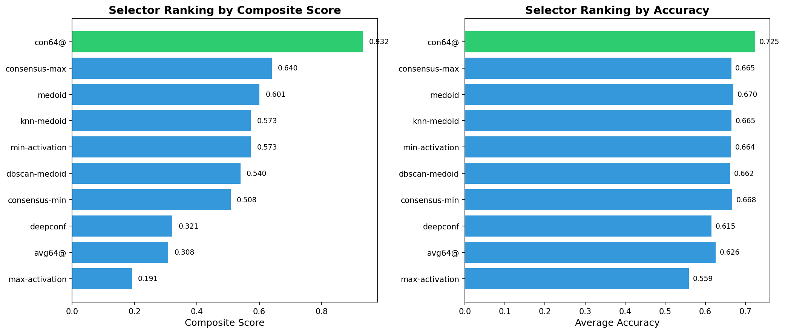
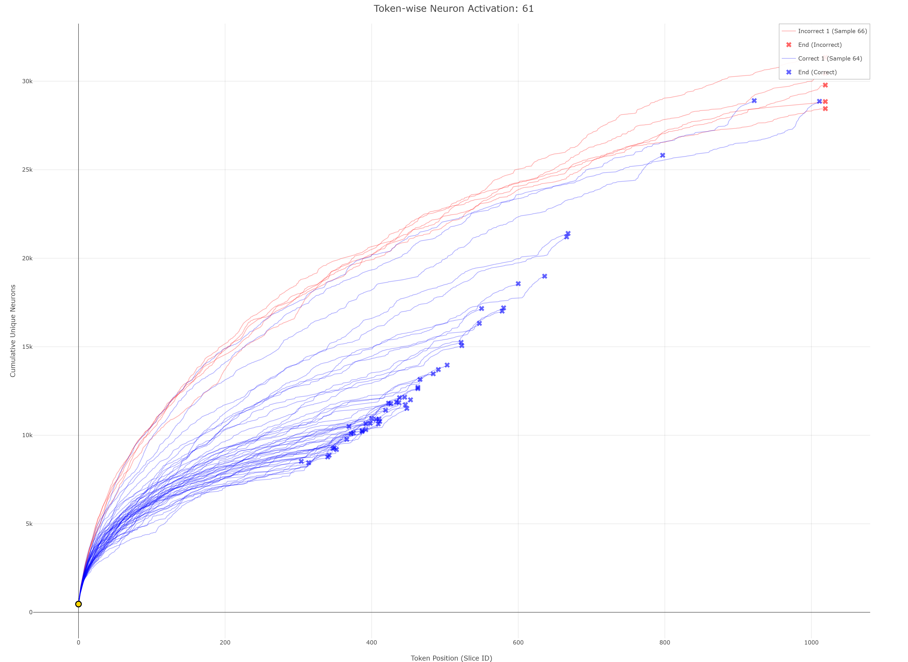
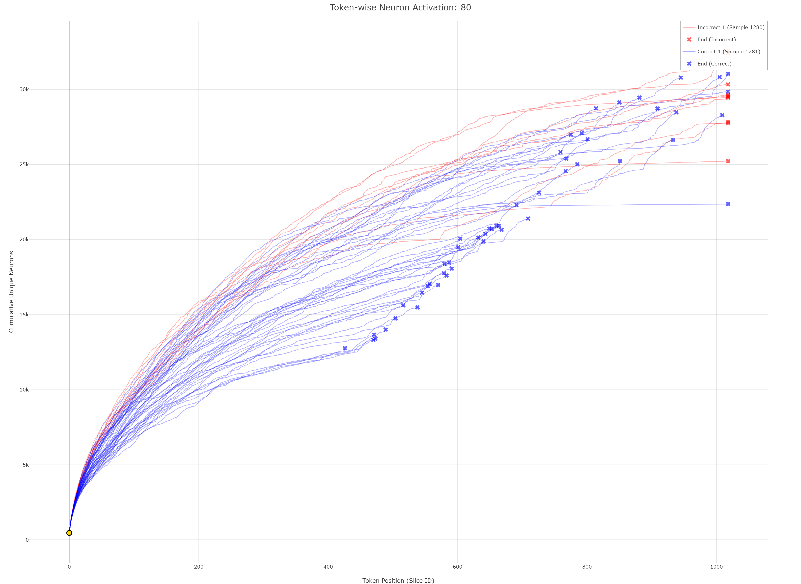
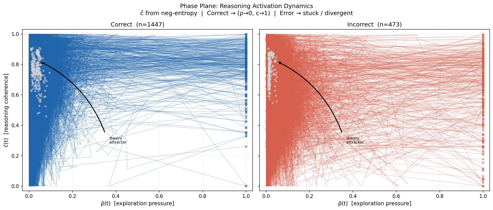
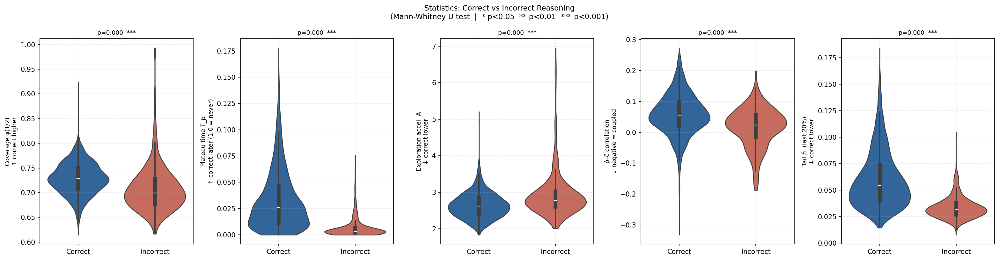
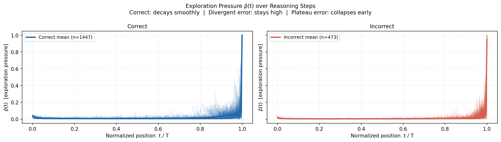

% NAD_Next
% 配套汇报 · 科技简约版
% 2026-04-24

# NAD_Next

## Neuron Activation Distribution

- 面向 `best_of_n` 与 `early_stop` 的实验分析与可视化工作区
- 关键词：`activation`、`selector`、`targeted patch`、`benchmark-selective router`
- 配套网站：`http://10.176.42.41:2992/user/zhengxinyi/proxy/4173/#/`

# 目录

- 01｜项目背景与问题定义
- 02｜Best-of-N：为什么最终选择 very small patch
- 03｜Activation：看到了什么，为什么没进主线
- 04｜Early-stop：为什么 selective enabling 更稳
- 05｜结论与后续展示方式

# 01｜项目背景

## 这个项目在解决什么

- **目标**：围绕 activation cache，分析哪些选择规则在不同 benchmark 上真正稳定有效
- **工作流**：读取 cache → 跑 selector / policy → 评估 → 汇总到网站可视化
- **核心难点**：
  - 局部有效信号，未必能安全扩展成全局规则
  - 复杂方法常常“有现象”，但不一定“可提交”

# 01｜方法总览

## 我们的方法论

- **先找局部稳定收益区**，再决定是否放入主线
- **先做 very small patch**，避免统一大改带来回退风险
- **把 activation / dynamics 当作证据层**，而不是默认直接升级为最终决策层
- **网站角色**：沉淀完整实验链路；PPT 角色：提炼最关键的决策逻辑

# 02｜Best-of-N

## 最终主线方案

- **最终卡片**：`nad_mixed_v2_aime_top2_gap1e3_logprob`
- **核心动作**：只在 AIME 四个 cache 上做 `top2 gap + tok_logprob` 的 very small patch
- **策略关键词**：`targeted`、`small`、`conservative`
- **结果**：
  - `mean_score = 0.6154398`
  - 相比完整 baseline 仅小幅提升，但风险最低、最可控

{ width=74% }

# 02｜Best-of-N

## 为什么不是更复杂的路线

- **复杂路线确实有局部信号**：例如 local head、router、EM regularized
- **但问题在于**：它们没有稳定转化成更强的最终主提交
- **最终决策**：
  - 对确定收益区做极小 patch
  - 对其余 cache 保守不动
- **结论**：`very small AIME-only patch` 是当前最稳的工程解

# 03｜Activation

## 看到了什么现象

- **A1 路线**：`A1 = medoid + activation tie-break`
- **图像层面**：可以稳定观察到代表性轨迹差异
- **说明**：activation 信号不是噪声，而是真有区分度
- **价值**：它提供了解释能力，也为后续 tail warning / 局部 veto 提供线索

{ width=68% }

# 03｜Activation

## 为什么没有进入最终主线

- **问题不在“有没有现象”**，而在“是否足够稳定”
- **局部 case 有帮助**，但直接挂到主 tie-break 上，收益不够稳
- **最终定位**：
  - 解释层
  - 辅助证据层
  - 小范围修补线索
- **结论**：activation 更适合 supporting evidence，而不是 main policy

{ width=68% }

# 04｜Early-stop

## 从 confidence baseline 到 dynamics plugin

- **baseline**：`early_stop_mean_confidence`
  - `AUC-AUROC = 0.6128`
  - `AUC-SelAcc = 0.6079`
- **confidence + conservative dynamics**：
  - `AUC-AUROC = 0.6326`
  - `AUC-SelAcc = 0.6473`
- **增益**：
  - `ΔAUC-AUROC = +0.0199`
  - `ΔAUC-SelAcc = +0.0394`

# 04｜Early-stop

## 为什么要 selective enabling

- **稳定收益区**：`DS-R1/aime24`、`DS-R1/aime25`、`DS-R1/hmmt25`
- **保守禁用区**：`DS-R1/brumo25`、`DS-R1/gpqa`、`DS-R1/lcb_v5`
- **router 的价值**：不是扩大覆盖，而是把 plugin 限制在“已知正收益区”
- **最终思路**：benchmark-selective enabling 比全局启用更稳

{ width=74% }

# 04｜Early-stop

## 最终提交策略

- **最终卡片**：`early_stop_dynamics_router_conservative_submit`
- **主 route**：
  - `aime24 -> rho_tail_plus_neg_A_accel`
  - `aime25 -> neg_A_accel_only`
  - `hmmt25 -> rho_tail_plus_neg_A_accel`
- **禁用策略**：对 `brumo25 / gpqa / lcb_v5` 保守禁用 dynamics
- **结论**：最终不是“更复杂”，而是“更克制”

{ width=74% }

# 05｜结论

## 三个核心判断

- **Best-of-N**：very small AIME-only patch 最稳
- **Activation**：是重要证据层，但不适合作为当前主 tie-break
- **Early-stop**：benchmark-selective router 最稳，保守裁剪优于全局放开

# 05｜展示建议

## 网站与 PPT 如何配合

- **PPT**：负责主叙事，适合答辩、组会、阶段汇报
- **网站**：负责 drill-down，适合现场解释具体 case、sample、benchmark 数值
- **推荐方式**：
  - 先用 PPT 讲决策链路
  - 再打开网站展示交互图细节

{ width=70% }

# Thanks

## Q & A

- 网站可用于现场追问时的交互展示
- PPT 源稿可继续扩展为答辩版 / 英文版 / 汇报词版
